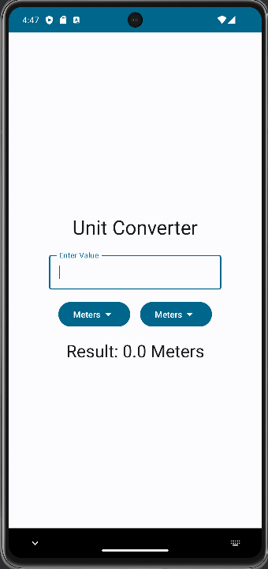
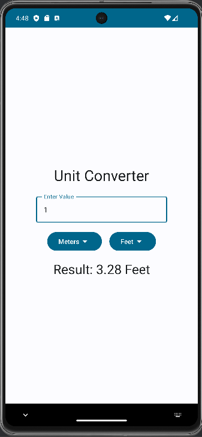
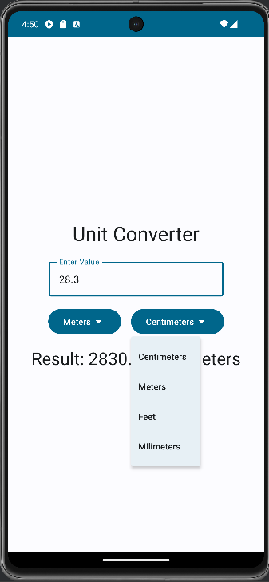

# Unit Converter

Unit Converter is a sleek and intuitive Android application designed to simplify the process of unit conversion for users. Built with Jetpack Compose, it offers a modern and delightful user experience, allowing users to effortlessly convert between various units of measurement.

## Features

- **Intuitive User Interface**: The app boasts a clean and user-friendly interface, making it easy for users to input values and select input and output units.
  
- **Wide Range of Units**: Unit Converter supports conversion between an extensive range of units, including centimeters, meters, feet, millimeters, and more.

- **Real-Time Conversion**: Get instant conversion results displayed in real-time as you input values or change units, ensuring quick and accurate conversions.

- **Customizable Styling**: Tailor the app's appearance to your preferences with customizable styling options, including font styles, colors, and themes.

## Screenshots

 
&nbsp; &nbsp; &nbsp;
 

## Getting Started

To get started with the Unit Converter app, follow these steps:

1. **Clone the Repository**: Clone this repository to your local machine using the following command:
git clone https://github.com/nishkarsh25/Unit-Converter-App.git

2. **Open in Android Studio**: Open the project in Android Studio to explore the codebase and build the app.

3. **Run the App**: Build and run the app on an Android emulator or physical device to see it in action.

## Requirements

- **Android Studio**: Version 4.2 or later
- **Kotlin**: Version 1.5.0 or later
- **Android SDK**: Version 21 or later

## Contributing

Contributions are welcome! If you'd like to contribute to this project, please follow these steps:

1. **Fork the Repository**: Fork this repository to your GitHub account.

2. **Create a New Branch**: Create a new branch for your feature or bug fix.

3. **Make Changes**: Make your changes and test them thoroughly.

4. **Commit and Push**: Commit your changes and push them to your forked repository.

5. **Submit a Pull Request**: Submit a pull request to the main repository's `main` branch, describing your changes in detail.

## License

This project is licensed under the MIT License. See the [LICENSE](LICENSE) file for details.

## Acknowledgements

- **Jetpack Compose**: This app was built using Jetpack Compose, the modern UI toolkit for Android.
- **Material Design Icons**: Icons used in the app are from the Material Design icon pack.

## Contact

If you have any questions, suggestions, or feedback regarding this project, feel free to contact the project maintainer:

- **Nishkarsh Gupta**
- **Email**: nishkarshgupta671@gmail.com
- **GitHub**: [My GitHub](https://github.com/nishkarsh25?tab=repositories)
